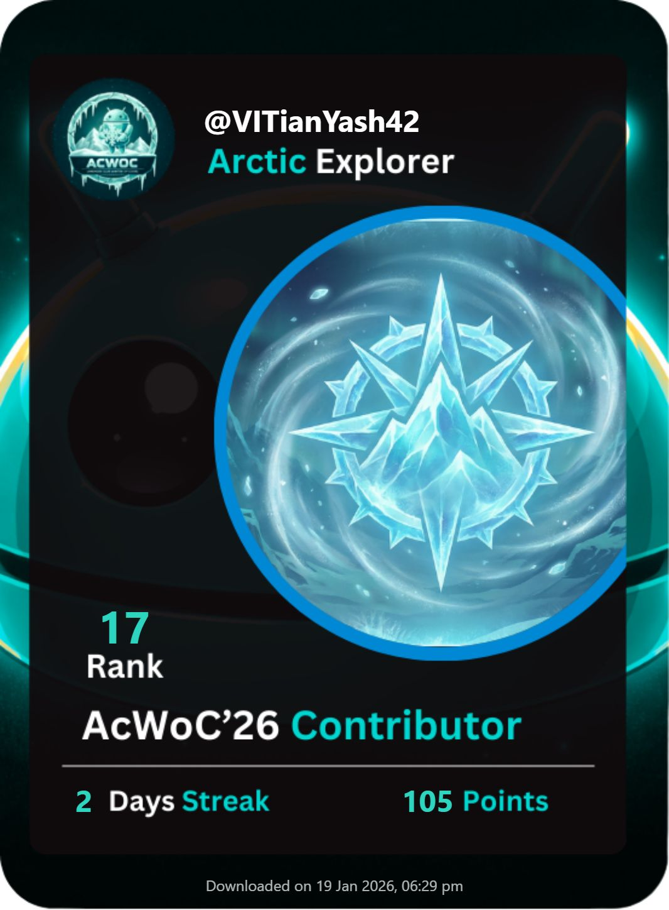
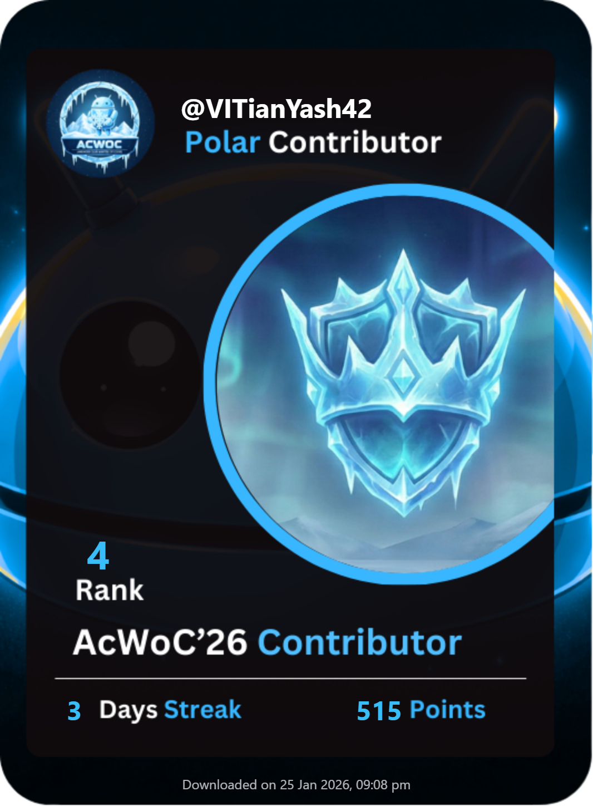
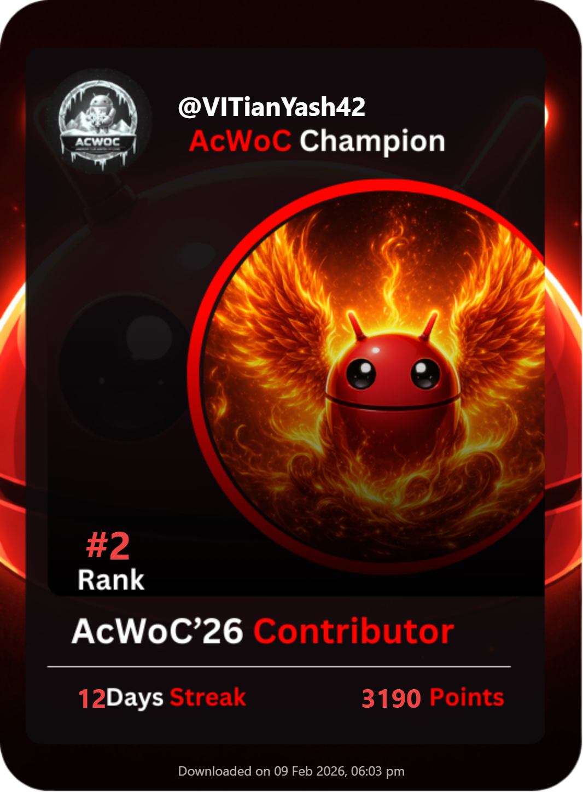

  

<h1 align="center">Hi there, I'm Yash 👋</h1>

<h2 align="center">
  🚀 Full-Stack Developer | Open Source Enthusiast  
  🏆 #2 Contributor in ACWOC'26 | 🥉 3rd Place @Hackathon 101 | 🏅 National Finalist @Health Hackathon '26
</h2>

  <h3>🏆 AcWoC '26 Hall of Fame</h3>
  
My journey to <b>Rank #2</b> in the Android Club - Open Source Challenge.

  
  
  &nbsp;&nbsp;➡️&nbsp;&nbsp;
  
  
  &nbsp;&nbsp;➡️&nbsp;&nbsp;
  
  

 

---

### 👨‍💻 About Me

I'm a Second Year Computer Science student on a mission to build cool things and solve problems. I'm driven by the challenge of turning complex ideas into functional, real-world applications. Right now, I'm focused on strengthening my foundational skills in Data Structures & Algorithms and diving deep into web development.

* 🎓 Studying **Computer Science** at **Vellore Institute of Technology, Bhopal**.
* 🌱 Learning everything I can about **Web Development** and **Data Structures & Algorithms**.
* 💡 Deep-diving into **Full-Stack Architecture**, **Web3 / Blockchain Integration**, and **AI/ML Engineering**.
* 📫 **Reach me at:** yashjee979@gmail.com

---

### 🏆 Achievements & Highlights

* 🥈 **Rank #2 Contributor** in **ACWOC'26** (Android club Winter of Code) Open Source Challenge.
* 🥉 **3rd Place in Hackathon 101** (CISCO Community) for a marketplace prototype built in 36 hours.
* 🏅 **National Finalist @ Health Hackathon '26** (VIT Bhopal x JHU). Built "Gati Rehab," an AI physiotherapy monitor.
* 🏆 **Top 6 Finalist (out of ~137 teams) @INNOVIT'26 Hackathon.** Architected "Mess-Metric", a Web 2.5 food sustainability ERP.
* 🎖️ **Champion Badge Recipient** in AcWoC'26 for high-impact pull requests (**97 Total PRs**).
* 🚀 **Currently Learning:** Dockerizing legacy apps, resolving complex Git conflicts, and building developer tools.

---

### 🛠️ Tech Stack & Arsenal

| **Category** | **Technologies** |
|:--- |:--- |
| **Languages** |        |
| **Backend** |   |
| **DevOps & Cloud** |    |
| **Tools & AI** |   |

---

## 🚀 Featured Projects

### 🏥 **[Gati Rehab: Offline-First AI Physiotherapy PWA](https://github.com/VITianYash42/Gati-rehab)**
> *An AI-powered virtual rehab assistant providing zero-latency skeletal tracking entirely on the browser.*
> 
> **Tech Stack:** `React.js` • `Google MediaPipe` • `Firebase` • `TensorFlow Lite` • `PWA`
> 
> **Highlight:** National Finalist (**Top 60 out of 600+ teams**) @Health Hackathon '26 (VIT'B x Johns Hopkins).
> 
> 🔗 **[GitHub Repository](https://github.com/Sumit-5002/Gati-rehab)** | 🌐 **[Live Demo](https://gati.web.app/)**

---

### 🌿 **Mess-Metric: AI & Web3 Food Sustainability Portal**
> *An enterprise-grade ERP designed to eliminate campus food waste through machine learning and blockchain gamification.*
> 
> **Tech Stack:** `React.js` • `Node.js` • `MongoDB` • `Gemini AI` • `Polygon Web3`
> 
> **Highlight:** Top 6 in our theme **(Top 38 out of 137 teams) in INNOVIT'26 Hackathon**.
> 
> 🔗 **[GitHub Repository](https://github.com/VITianYash42/mess-metric)** | 🌐 **[Live Demo](https://mess-metric.vercel.app)**

---

### ⚗️ **Chemical Equipment Visualizer: Hybrid Data Dashboard**

> *A full-stack data science platform featuring both Web and Desktop clients for analyzing and visualizing chemical engineering datasets.*
> 
> **Tech Stack:** `Django REST` • `React.js` • `PyQt5` • `Pandas` • `Chart.js`
>
> **Highlight:** Architected a "Thin Client" system where a centralized secure API serves synchronized statistical data to both a React web dashboard and a native PyQt5 desktop application, complete with automated PDF report generation.
>
> 🔗 [GitHub Repository](https://github.com/VITianYash42/fossee-internship-2026)

---

### 🛡️ **DeceptiScan: Interactive Phishing Simulation Platform**
> *A full-stack, gamified security awareness platform designed to test and train users against real-world social engineering attacks.*
>
> **Tech Stack:** `Python` • `Flask` • `SQLite` • `Docker` • `Tailwind CSS`
> 
> **Highlight:** Survived a grueling 3-phase elimination to place **Top 9 out of 300+ teams** at the Cyber Carnival Hackathon.
>
> 🔗 [GitHub Repository](https://github.com/VITianYash42/DeceptiScan) | 🌐 [Live Demo](#)

---

### 📂 My Top Contributions

#### 1. **[Layr (VS Code Extension)](https://github.com/manasdutta04/layr)** 🧩
*A developer tool for AI-powered project planning.*
* **My Role:** Built the **Community Templates Library** & **Template Manager**.
* **Tech:** TypeScript, VS Code Webview API, FileSystem Architecture.
* **Impact:** Enabled users to save, browse, and inject project scaffolds (React, Node, etc.) directly within VS Code.

#### 2. **[MediAssist AI Scribe](https://github.com/garvit-010/MediAssist_AI_Powered_Scribe)** 🏥
*AI-powered medical transcription and analysis tool.*
* **My Role:** Led the **Dockerization** and Production Deployment.
* **Tech:** Python, Flask, Docker (Multi-stage builds), Gunicorn, Ollama (Llama 3).
* **Impact:** Reduced deployment time and ensured environment consistency across dev/prod.

#### 3. **[Project Toolsuite](https://github.com/Winter262005/Project-Toolsuite)** 🛠️
*A collection of open-source developer tools and visualizations.*
* **My Role:** Developed the Offline Regex Tester and the Mandelbrot Set Generator; resolved multiple critical issues.
* **Tech:** JavaScript (ES6+), HTML5 Canvas, CSS3.
* **Impact:** Added essential developer utilities and high-performance mathematical visualizations to the platform.

---

  

  

---

### 🤝 Let's Connect!

  &nbsp;&nbsp;
  &nbsp;&nbsp;
  

